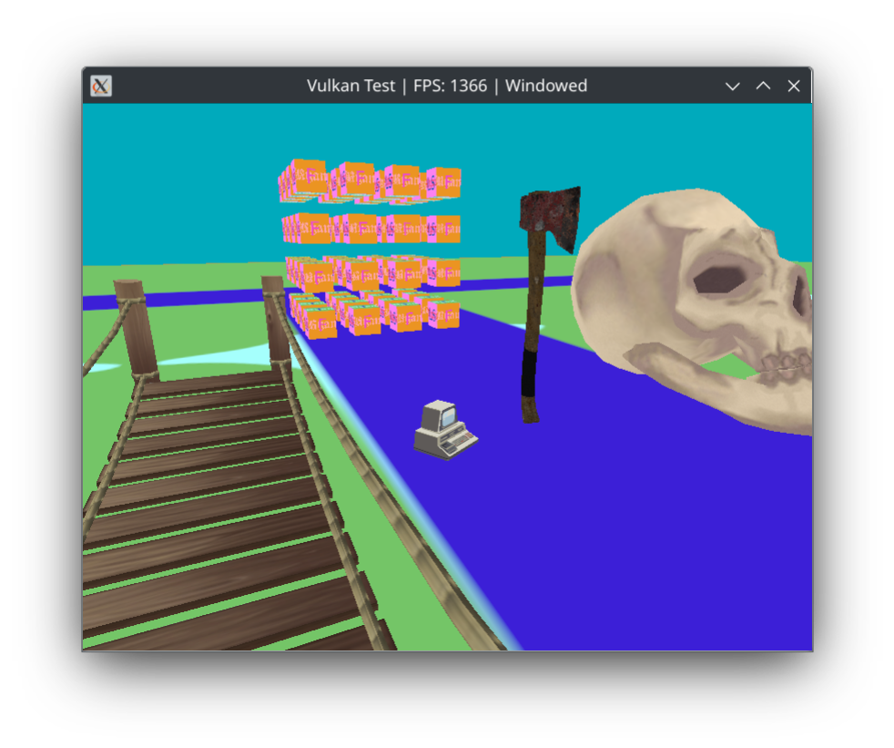
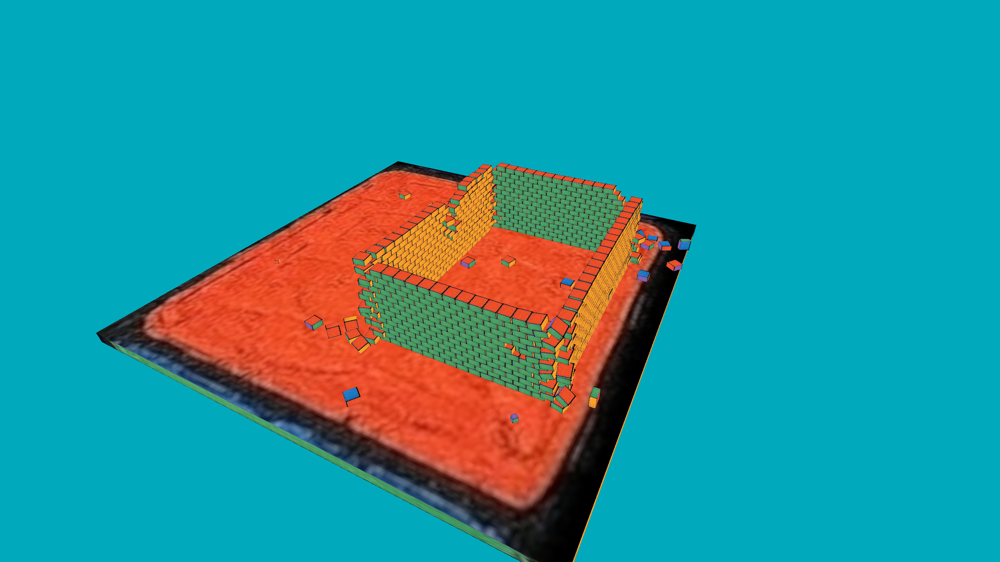

# Vulkan Demo

Vulkan Demo is a cross-platform graphics application demonstrating Vulkan rendering.

It is clearly a very basic demonstration and it's purpose isn't to compete with fully fledged game engines. Instead it's a practice of working with underlying graphics APIs and working directly with the GPU. 

On top of that, it shows that once you have the basics of the graphics API controlled, it's not to difficult to get basic models loaded, and physics integration (ReactPhysics3D).


## Controls

### Movment

 - WASD
 - LSHIFT to decrease height
 - SPACE to increase height


### Other

 - Tab to open menu
 - Esc to pause
 - Q to quit

## Screenshots





## Shader Compilation: glslc

This project uses `glslc` to compile GLSL shaders to SPIR-V. `glslc` is part of the [Vulkan SDK](https://vulkan.lunarg.com/) and is also available via package managers.

### Install glslc

#### Fedora
```bash
sudo dnf install glslc
```

#### Ubuntu/Debian
```bash
sudo apt install glslc
```

#### Arch Linux
```bash
sudo pacman -S glslang
```

#### macOS (Homebrew)
```bash
brew install glslang
```

Alternatively, you can use the `glslc` binary included in the Vulkan SDK.

## Compile & run

```bash
make shaders

cd build
cmake ..
make

./VulkanTest
```

[Vulkan SDK](https://vulkan.lunarg.com/)

*Optional: If you want to use the official Vulkan SDK (for validation layers, tools, or headers), download and set up as follows:*

```bash
# Download and extract the Vulkan SDK from https://vulkan.lunarg.com/ (choose the version for your platform)

# Set up environment variables (adjust the path to your installation):
export VULKAN_SDK="$HOME/Downloads/vulkansdk/<version>"
source "$VULKAN_SDK/setup-env.sh"
```


# Dependencies


Required libraries:
- Vulkan SDK
- GLFW
- GLM
- Vulkan Loader
- Vulkan Validation Layers
- X11 development libraries (Linux)
- CMake
- ReactPhysics3D
- ImGui
## ImGui setup

Clone the ImGui repository into your `libs/` directory:
```bash
git clone https://github.com/ocornut/imgui.git libs/imgui
```
No additional build steps are required; CMake will build ImGui automatically when you build this project.


## ReactPhysics3D setup

Clone the ReactPhysics3D repository into your `libs/` directory:
```bash
git clone https://github.com/DanielChappuis/reactphysics3d.git libs/reactphysics3d
```
No additional build steps are required; CMake will build ReactPhysics3D automatically when you build this project.

## Example installation commands

### Fedora
```bash
sudo dnf install vulkan-tools glfw-devel glm-devel libXi-devel libXxf86vm-devel vulkan-loader-devel mesa-vulkan-devel vulkan-validation-layers-devel cmake
```

### Ubuntu/Debian
```bash
sudo apt install vulkan-tools libglfw3-dev libglm-dev libvulkan-dev libxi-dev libxinerama-dev libxcursor-dev libxrandr-dev cmake
```

### Arch Linux
```bash
sudo pacman -S vulkan-tools glfw glm vulkan-icd-loader vulkan-validation-layers cmake
```

### macOS (using Homebrew)
```bash
brew install glfw glm vulkan-sdk cmake
```

Note: Package names may vary by distribution. Refer to your OS documentation for details.


# wip structure

Responsibilities of each class
```
main.cpp: This file would contain the main() function and the high-level control flow of your program. It would instantiate objects and call methods from other classes.

VulkanSetup.hpp and VulkanSetup.cpp: These files would contain the setup and cleanup code for Vulkan. The CreateDebugUtilsMessengerEXT and DestroyDebugUtilsMessengerEXT functions could go here. This class would handle the creation and destruction of the Vulkan instance, the physical and logical devices, the swap chain, etc.

Vertex.hpp and Vertex.cpp: These files would contain the Vertex struct and any related functions, such as the bindingDescription and attributeDescriptions functions.

Render.hpp and Render.cpp: These files would handle the rendering loop, including creating command buffers, drawing frames, and handling synchronization.

Shader.hpp and Shader.cpp: These files would handle shader-related tasks, such as loading shaders from files, creating shader modules, and managing the pipeline layout.

Window.hpp and Window.cpp: These files would handle window creation and input events. This would likely use a library like GLFW or SDL.

```

Object Structure:
```
Application
    Window
    Render(Window&)
        Shader(VkDevice&, VkRenderPass&)
        VulkanSetup(Window&, VkRenderPass&)
```

# todo

  `[ ]` Move `commandPool` to VulkanSetup class?

  `[ ]` Move all `Descriptor*` code to VulkanSetup class?

  `[ ]` Create a `Scene` class

  `[ ]` Triple buffering

  `[ ]` All of the helper functions that submit commands so far have been set up to execute synchronously by
         waiting for the queue to become idle. For practical applications it is recommended to combine these
         operations in a single command buffer and execute them asynchronously for higher throughput, especially
         the transitions and copy in the createTextureImage function. Try to experiment with this by creating a 
         setupCommandBuffer that the helper functions record commands into, and add a flushSetupCommands to 
         execute the commands that have been recorded so far. It's best to do this after the texture mapping 
         works to check if the texture resources are still set up correctly.
       https://registry.khronos.org/vulkan/specs/1.3-extensions/html/chap7.html#synchronization-submission-host-writes 

  `[ ]` VulkanSetup::recreateSwapChain - Fullscreening with F11 (Window::keyCallback) causes this function
         to be called constantly. Eventually causing a crash:
         BadAccess (attempt to access private resource denied)

  `[ ]` When having multiple instances of the `Box` model. The `loadModel` method only
  needs to run once. (need to clean up, but kinda done)
  https://old.reddit.com/r/vulkan/comments/e7n5b6/drawing_multiple_objects/fa3fn8f/

  `[ ]` cmake

  `[ ]` create a `modelManager` class to remove the bs static members


# vulkan shader

Vulkan expects the data in your structure to be aligned in memory in a specific way, for example:

    Scalars have to be aligned by N (= 4 bytes given 32 bit floats).
    A `vec2` must be aligned by 2N (= 8 bytes)
    A `vec3` or `vec4` must be aligned by 4N (= 16 bytes)
    A nested structure must be aligned by the base alignment of its members rounded up to a multiple of 16.
    A `mat4` matrix must have the same alignment as a `vec4`.

You can find the full list of alignment requirements in [the specification](https://www.khronos.org/registry/vulkan/specs/1.3-extensions/html/chap15.html#interfaces-resources-layout).

https://vulkan-tutorial.com/en/Uniform_buffers/Descriptor_pool_and_sets

# tracy

https://github.com/wolfpld/tracy
https://github.com/wolfpld/tracy/releases/latest/download/tracy.pdf

clone `tracy` repo to the libs directory

include tracy source files

```cpp
#include <tracy/public/tracy/Tracy.hpp>
#include <tracy/public/TracyClient.cpp>
#include <tracy/public/tracy/TracyVulkan.hpp>
```

build the profiler

```shell
cd libs/tracy/profiler/build/unix
make release
./Tracy-release
```


# Resources

## Vulkan
- https://vulkan-tutorial.com/
- https://registry.khronos.org/vulkan/specs/1.3-extensions/man/html/VkQueueFlagBits.html
- https://github.com/KhronosGroup/Vulkan-Docs
- https://github.com/David-DiGioia/vulkan-diagrams
- https://github.com/KhronosGroup/Vulkan-Hpp
- https://github.com/KhronosGroup/Vulkan-Guide
- https://www.vulkan.org/learn#vulkan-tutorials
- https://github.com/GPUOpen-LibrariesAndSDKs/VulkanMemoryAllocator
- https://registry.khronos.org/vulkan/specs/1.3-extensions/html/chap7.html#VkPipelineStageFlagBits
- https://github.com/KhronosGroup/Vulkan-ValidationLayers/blob/main/docs/debug_printf.md
- https://developer.nvidia.com/vulkan-memory-management/
- https://vkguide.dev/docs/chapter-3/push_constants/

## C++ & General Programming
- https://isocpp.github.io/CppCoreGuidelines/CppCoreGuidelines
- https://en.cppreference.com/w/cpp/language/raii
- https://github.com/friendlyanon/cmake-init
- https://raytracing.github.io/books/RayTracingInOneWeekend.html

## Physics & Math
- https://jsantell.com/model-view-projection/
- https://johannesugb.github.io/gpu-programming/setting-up-a-proper-vulkan-projection-matrix/
- https://gafferongames.com/post/integration_basics/
- https://gafferongames.com/post/fix_your_timestep/
- https://gafferongames.com/

## Graphics & Shaders
- https://learnopengl.com/Getting-started/Camera
- https://lettier.github.io/3d-game-shaders-for-beginners/texturing.html

## Debugging & Tools
- https://renderdoc.org/
- https://cs.baylor.edu/~donahoo/tools/gdb/tutorial.html

## Models & Assets
- http://assimp.org/
- https://opengameart.org/content/wooden-bridge-0

## Videos & Tutorials
- https://www.youtube.com/watch?v=d4EgbgTm0Bg
